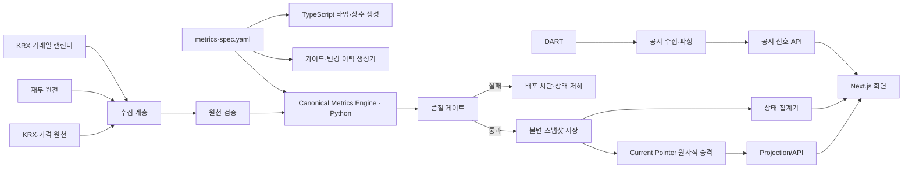

# 오른스코어 Metrics 2.5 신뢰성 재설계서

> **문서 성격:** 개발·QA·배포의 단일 기준이 되는 구현 명세서
>
> **대상 서비스:** `ornscore.com`
>
> **문서 버전:** 1.0
>
> **작성일:** 2026-07-15
>
> **목표 릴리스:** Metrics 2.5
>
> **상태:** 구현 준비 완료

---

## 0. 이 문서의 사용 규칙

이 문서는 단순 개선 의견이 아니라 **규범 문서**다. 개발 과정에서 현재 코드, 화면 문구, 지표 가이드, 변경 이력, 기존 주석이 이 문서와 충돌하면 이 문서를 우선한다.

이 문서에서 사용하는 용어의 강도는 다음과 같다.

- **MUST:** 반드시 구현해야 한다. 미충족 시 배포 불가다.
- **MUST NOT:** 절대 구현하거나 노출하면 안 된다.
- **SHOULD:** 특별한 사유가 없다면 구현한다. 미구현 시 PR에 사유를 남긴다.
- **MAY:** 선택 구현이다.

모든 산식 변경은 먼저 이 문서 또는 후속 버전의 명세에 반영한 뒤 코드로 옮긴다. 운영 코드만 바꾸거나 화면 문구만 바꾸는 수정은 금지한다.

---

# 1. 재설계의 핵심 결론

현재 반복적으로 문제가 생기는 이유는 개별 개발자의 실수 하나가 아니라 **같은 사실의 정답이 여러 군데 존재하기 때문**이다.

현재 구조에서는 다음이 서로 독립적으로 바뀔 수 있다.

1. Python 실제 데이터 생성기
2. TypeScript 참조 계산 코드
3. 지표 가이드
4. 산식 변경 이력
5. 종목 상세의 자동 문구
6. 오늘 페이지의 필터·명칭
7. 점수 이력의 비교 기준
8. 공개 상태 페이지

이 구조에서는 한 곳을 고쳐도 다른 곳이 다시 틀어진다. Metrics 2.5의 핵심은 기능 추가가 아니라 아래 네 가지다.

1. **계산 엔진을 하나만 둔다.**
2. **모든 점수 스냅샷에 날짜·산식·설정·유니버스 버전을 함께 저장한다.**
3. **문장을 숫자 조합으로 만들지 않고 검증된 의미 상태에서 생성한다.**
4. **비교할 수 없는 데이터는 API 단계에서 변화값을 차단한다.**

---

# 2. 릴리스 목표와 배포 합격 기준

## 2.1 릴리스 목표

Metrics 2.5 배포 후에는 다음 문장이 사실이어야 한다.

> 같은 입력 데이터와 같은 설정 버전을 사용하면 어느 화면에서도 같은 점수, 같은 상태, 같은 설명이 나온다.

## 2.2 최상위 합격 기준

아래 항목은 모두 MUST다.

- Python 이외의 코드가 공개 점수를 다시 계산하지 않는다.
- 운영 산식과 공개 문서가 동일한 설정 파일에서 생성된다.
- `전 거래일 대비`는 실제 직전 거래일 스냅샷이 존재할 때만 표시된다.
- 산식 버전, 설정 해시, 유니버스 버전 중 하나라도 다르면 점수·순위 변화값을 숨긴다.
- 음수 수익률에 `상승폭`, 양수 수익률에 `하락폭`이 표시되지 않는다.
- 거래활성도 상태가 오늘·종목 찾기·상세에서 동일하다.
- 현재 점수와 점수 이력의 `현재` 값이 동일하다.
- 공시 보고서명만으로 `대형`, `호재`, `악재`, `손익 정정`을 추정하지 않는다.
- 하위 데이터 상태에 제한이나 오류가 있으면 전체 상태를 `정상`으로 표시하지 않는다.
- 모든 필수 테스트가 CI에서 통과하지 않으면 배포할 수 없다.

---

# 3. 범위

## 3.1 이번 릴리스에 포함하는 항목

### P0 — 반드시 포함

- Metrics 2.5 단일 계산 엔진
- 기계 판독 가능한 산식 설정 파일
- 산식·설정·유니버스 버전이 포함된 불변 스냅샷
- KRX 거래일 기반 직전 거래일 판정
- 점수·순위 변화 비교 가능성 게이트
- 추세 국면 문구 엔진 재작성
- 수익률 부호별 문구 분기
- 거래활성도 상태 기준 통일
- 점수 이력 UI 데이터 구조 수정
- 상태 페이지 심각도 집계 수정
- 공시 자동분류 안전화
- 지표 가이드·변경 이력 자동 생성
- 단위·계약·스냅샷·E2E 테스트

### P1 — 같은 코드베이스에서 함께 정리

- 비교 화면의 `가장 좋은 값` 표현 제거
- 위험조정 효율과 절대 변동성 설명 분리
- 오늘 Top 카드에 종목별 반대 신호 표시
- 안정적인 SEO 메타데이터 유지

## 3.2 이번 릴리스의 비범위

다음은 Metrics 2.5의 완료 조건에 포함하지 않는다.

- 결제 및 유료 멤버십
- 카카오톡 알림
- 전체 상장 종목 확대
- 업종 분류 체계 전면 교체
- 새로운 AI 요약 기능
- 새로운 백테스트 전략
- 디자인 시스템 전면 개편

비범위 기능 때문에 P0 수정이 지연되어서는 안 된다.

---

# 4. 설계 결정 기록

| ID | 결정 | 이유 |
|---|---|---|
| D-01 | Python을 공개 점수의 유일한 계산 엔진으로 사용 | Python·TypeScript 산식 불일치 제거 |
| D-02 | 산식 상수는 `metrics-spec.yaml`에서 관리 | 코드·문서·화면 버전의 단일 기준 확보 |
| D-03 | TypeScript는 점수를 재계산하지 않음 | 프런트·백엔드 간 결과 차단 |
| D-04 | 위험조정 점수는 Sharpe 유사값의 유니버스 백분위로 산정 | 현재 운영 결과와 고점 포화 방지 목적을 명확히 통일 |
| D-05 | 필수 지표가 하나라도 없으면 공개 종합점수를 산출하지 않음 | 다른 지표로 결측을 숨기는 오해 방지 |
| D-06 | 점수 변화는 날짜·산식·설정·유니버스가 모두 같을 때만 허용 | `전 거래일 대비`의 의미 보장 |
| D-07 | 추세 국면의 대표 라벨은 1개월과 6개월 방향으로 결정 | 규칙 단순화와 문장 오류 방지 |
| D-08 | 3개월 수익률은 보조 맥락으로만 표시 | 대표 라벨과 실제 값의 모순 방지 |
| D-09 | 거래활성도 상태를 전역 공통 함수로 생성 | 페이지별 `급증`·`보통` 충돌 제거 |
| D-10 | 공시 유형과 공시 중요도를 분리 | 보고서명만으로 중요도·방향을 과장하지 않기 위함 |
| D-11 | 공개 문서는 설정 파일에서 생성 | 운영 산식과 가이드의 수동 불일치 제거 |
| D-12 | 과거 스냅샷은 수정하지 않음 | 재현성·감사 가능성 확보 |

---

# 5. 목표 아키텍처



## 5.1 단일 진실 공급원

| 사실 | 유일한 정답 위치 | 금지 사항 |
|---|---|---|
| 산식 상수·기간·가중치 | `config/metrics/2.5.yaml` | 코드에 중복 하드코딩 금지 |
| 점수 계산 | Python `metrics_core` | TypeScript 재계산 금지 |
| 운영 점수 | 게시된 불변 스냅샷 | 화면에서 즉석 계산 금지 |
| 거래일 | `trading_calendar` | 단순 날짜 빼기 금지 |
| 비교 가능 여부 | API `comparison.status` | 화면별 자체 판정 금지 |
| 활동 상태 | 공통 분류 함수 결과 | 페이지별 임계값 금지 |
| 추세 국면 | 공통 의미 상태 결과 | JSX 내부 문장 조합 금지 |
| 공개 가이드 | 설정 파일 기반 생성 결과 | 수동 숫자 작성 금지 |
| 변경 이력 | 버전 메타데이터 기반 생성 | 코드와 별도 수동 날짜 금지 |

## 5.2 권장 저장소 구조

현재 저장소에 다음 구조를 추가한다.

```text
config/
  metrics/
    2.5.yaml

scripts/
  compute_metrics.py              # 얇은 실행 진입점
  metrics/
    core.py                        # 유일한 산식 구현
    percentile.py                 # 공통 백분위 구현
    validators.py                 # 데이터·불변식 검증
    contracts.py                  # 스냅샷 타입
    publish.py                    # 원자적 게시
  generate_metrics_artifacts.py   # 문서·TS 상수 생성

src/
  generated/
    metrics-spec.ts               # YAML에서 자동 생성, 수정 금지
  lib/
    metric-format.ts              # 표시만 담당
    signal-copy.ts                # 의미 상태 → 문구
    disclosure-copy.ts            # 공시 상태 → 문구
  types/
    metrics-api.ts

public/data/ 또는 DB/
  snapshots/
  status/
  metrics-spec.json
```

기존 `src/lib/metrics.ts`의 공개 점수 계산 함수는 제거하거나 테스트 전용으로 격리한다. 운영 UI에서 import하면 CI가 실패하도록 정적 검사 규칙을 추가한다.

---

# 6. Metrics 2.5 정식 산식

이 절이 공개 점수 산식의 규범 정의다. 동봉된 `ornscore_metrics_spec_v2_5.yaml`과 내용이 같아야 한다.

## 6.1 공통 계산 규칙

- 가격 입력은 수정종가를 사용한다.
- 거래활성도 입력은 주식 체결 수량인 거래량을 사용한다.
- 계산 기준일은 게시 대상 KRX 거래일의 장마감이다.
- 중간 계산값은 반올림하지 않는다.
- 스냅샷에는 원시값을 최소 소수점 6자리 정밀도로 저장한다.
- 공개 점수는 소수점 첫째 자리까지 `ROUND_HALF_UP`으로 확정 저장한다.
- 화면의 정수 표시는 저장된 1자리 점수를 다시 `ROUND_HALF_UP`한다.
- Python 기본 `round()`와 JavaScript `Math.round()`의 차이를 피하기 위해 공통 반올림 함수를 사용한다.
- 모든 점수는 0~100 범위를 벗어나지 않아야 한다.

## 6.2 공통 백분위 함수

백분위 점수는 평균 순위 방식으로 계산한다.

```text
1. 유효한 원시값을 오름차순 정렬한다.
2. 동점은 해당 위치들의 평균 순위를 사용한다.
3. N > 1일 때:
   percentile = 100 × (average_rank_1_based - 1) / (N - 1)
4. N = 1이면 50점을 반환한다.
```

이 방식의 성질은 다음과 같다.

- 최솟값은 0점이다.
- 최댓값은 100점이다.
- 동점은 같은 점수를 받는다.
- 유니버스 순서에 영향을 받지 않는다.

### Python 기준 의사코드

```python
from decimal import Decimal, ROUND_HALF_UP


def percentile_rank(values: list[float]) -> list[float]:
    if len(values) == 1:
        return [50.0]

    indexed = sorted(enumerate(values), key=lambda item: item[1])
    out = [0.0] * len(values)
    i = 0

    while i < len(indexed):
        j = i
        while j + 1 < len(indexed) and indexed[j + 1][1] == indexed[i][1]:
            j += 1

        average_rank = ((i + 1) + (j + 1)) / 2
        score = 100 * (average_rank - 1) / (len(values) - 1)

        for k in range(i, j + 1):
            out[indexed[k][0]] = score
        i = j + 1

    return out
```

## 6.3 추세 점수

### 입력 조건

- 수정종가 127개 이상이 필요하다.
- 기준일 종가와 21·63·126거래일 전 종가가 모두 존재해야 한다.
- 조건 미충족 시 `momentumScore = null`이다.

### 원시값

```text
r21  = 기준일 종가 / 21거래일 전 종가 - 1
r63  = 기준일 종가 / 63거래일 전 종가 - 1
r126 = 기준일 종가 / 126거래일 전 종가 - 1

momentumRaw = 0.30 × r21 + 0.40 × r63 + 0.30 × r126
```

수익률 원시값은 내부에서 소수로 계산하고, API에서는 `%` 값도 별도 제공한다.

### 점수

```text
momentumScore = momentumRaw의 현재 유효 유니버스 내 백분위
```

## 6.4 거래활성도 점수

### 입력 조건

- 유효한 거래량 20개 이상이 필요하다.
- 최근 20일 평균 거래량이 0이면 계산 불가다.
- 조건 미충족 시 `activityScore = null`이다.

### 원시값

```text
activityRatio = 최근 5거래일 평균 거래량 / 최근 20거래일 평균 거래량
```

### 점수 매핑

```text
ratio < 0.5        → 10
0.5 ≤ ratio < 1.0  → 10 + (ratio - 0.5) × 80
1.0 ≤ ratio < 3.0  → 50 + (ratio - 1.0) × 25
ratio ≥ 3.0        → 100
```

이 지표는 유니버스 백분위가 아니다. 거래량 비율의 고정 구간 매핑이다.

## 6.5 밸류 점수

### 입력 조건

- PER과 PBR이 모두 존재해야 한다.
- PER과 PBR은 모두 0보다 커야 한다.
- 데이터 기준일 또는 재무 데이터 기준 기간이 품질 규칙을 통과해야 한다.
- 조건 미충족 시 `valueScore = null`이다.

### 점수

```text
perPercentile = PER의 오름차순 백분위
pbrPercentile = PBR의 오름차순 백분위

perCheapnessScore = 100 - perPercentile
pbrCheapnessScore = 100 - pbrPercentile

valueScore = (perCheapnessScore + pbrCheapnessScore) / 2
```

업종 내 밸류는 별도 참고 지표이며 종합점수에 포함하지 않는다.

## 6.6 위험조정 점수

### 입력 조건

- 수정종가 253개 이상이 필요하다.
- 일간 수익률 252개가 필요하다.
- 연환산 표준편차가 0이면 계산 불가다.
- 조건 미충족 시 `riskAdjustedScore = null`이다.

### 원시값

```text
dailyReturn[t] = close[t] / close[t-1] - 1
annualReturn   = mean(dailyReturn) × 252
annualStd      = populationStd(dailyReturn) × sqrt(252)
sharpeLike     = (annualReturn - 0.035) / annualStd
```

`populationStd`는 분산 계산 시 `N`으로 나눈다. 다른 정의를 사용하려면 산식 버전을 올려야 한다.

### 점수

```text
riskAdjustedScore = sharpeLike의 현재 유효 유니버스 내 백분위
```

위험조정 점수는 절대 안전성 점수가 아니다. 절대 변동성과 최대낙폭은 별도 필드로 제공한다.

## 6.7 종합점수와 결측 정책

### 필수 지표

- `momentumScore`
- `activityScore`
- `valueScore`
- `riskAdjustedScore`

네 값이 모두 유효할 때만 종합점수를 계산한다.

```text
compositeScore =
  (momentumScore + activityScore + valueScore + riskAdjustedScore) / 4
```

### 결측 정책

필수 지표가 하나라도 `null`이면 다음과 같이 처리한다.

```json
{
  "compositeScore": null,
  "rankingEligible": false,
  "qualityStatus": "INCOMPLETE_METRICS"
}
```

MUST NOT:

- 결측 지표를 50점으로 임의 대체하지 않는다.
- 다른 세 지표 평균을 결측 지표에 복사하지 않는다.
- 결측을 숨긴 채 4지표 동일가중이라고 설명하지 않는다.

화면에는 다음처럼 표시한다.

```text
종합점수 산출 보류
밸류 지표 계산에 필요한 PER·PBR을 확인할 수 없습니다.
나머지 지표는 개별적으로 확인할 수 있습니다.
```

---

# 7. 산식 설정 파일

운영 계산기는 `config/metrics/2.5.yaml`을 반드시 읽어야 한다. 설정값을 Python 코드에 다시 적지 않는다.

설정 파일의 SHA-256을 계산해 모든 스냅샷에 `configHash`로 저장한다.

```text
metricsVersion  = 2.5.0
configHash      = sha256(canonicalized_yaml)
universeVersion = 해당 거래일 유니버스 스냅샷 버전
```

문서, API, 상태 페이지에는 최소한 `metricsVersion`을 표시하고, 상세 진단 화면에는 `configHash` 앞 8자리를 표시할 수 있다.

---

# 8. 데이터 모델

저장 기술이 Supabase인지 파일인지는 구현 세부사항이다. 아래 논리 모델과 API 계약은 반드시 지켜야 한다.

## 8.1 거래일 캘린더

```sql
trading_calendar (
  market              text,        -- XKRX
  market_date         date,
  is_trading_day      boolean,
  previous_market_date date null,
  next_market_date     date null,
  source              text,
  loaded_at            timestamptz,
  primary key (market, market_date)
)
```

MUST:

- `previous_market_date`는 KRX 거래일 기준으로 계산한다.
- 주말·공휴일을 단순 제외하는 로직으로 대체하지 않는다.
- 캘린더가 없거나 불확실하면 `전 거래일 대비`를 표시하지 않는다.

## 8.2 파이프라인 실행

```sql
pipeline_run (
  run_id               uuid primary key,
  market_date          date,
  started_at           timestamptz,
  finished_at          timestamptz null,
  status               text,
  metrics_version      text,
  config_hash          text,
  universe_version     text,
  source_manifest      jsonb,
  quality_summary      jsonb,
  failure_reason       text null
)
```

상태 값:

```text
CREATED
INGESTED
VALIDATED
COMPUTED
QA_PASSED
PUBLISHED
FAILED_INGESTION
FAILED_VALIDATION
FAILED_COMPUTATION
FAILED_QA
```

## 8.3 유니버스 스냅샷

```sql
universe_snapshot (
  universe_version     text primary key,
  market_date          date,
  ticker_count         integer,
  constituents         jsonb,
  created_at           timestamptz
)
```

`universeVersion`은 구성 종목과 제외·보류 상태를 포함한 정규화 목록의 해시로 생성한다.

## 8.4 종목 점수 스냅샷

```sql
stock_metric_snapshot (
  snapshot_id          uuid primary key,
  run_id               uuid,
  market_date          date,
  ticker               text,
  metrics_version      text,
  config_hash          text,
  universe_version     text,

  raw_metrics          jsonb,
  scores               jsonb,
  semantic_states      jsonb,
  quality_flags        jsonb,

  composite_score      numeric null,
  ranking_eligible     boolean,
  published_at         timestamptz,

  unique (market_date, ticker, metrics_version, config_hash, universe_version)
)
```

### `raw_metrics` 예시

```json
{
  "returnsPct": {
    "r21": -8.1,
    "r63": -17.5,
    "r126": 1.0
  },
  "momentumWeightedReturnPct": -9.13,
  "activity": {
    "avgVolume5": 1234567,
    "avgVolume20": 781234,
    "ratio": 1.58
  },
  "value": {
    "per": 8.8,
    "pbr": 0.51,
    "roePct": 6.0
  },
  "risk": {
    "annualReturnPct": -1.2,
    "annualStdPct": 32.3,
    "sharpeLike": -0.20,
    "maxDrawdownPct": -25.1,
    "worstDayPct": -7.4
  }
}
```

### `scores` 예시

```json
{
  "momentum": 51.2,
  "activity": 64.5,
  "value": 80.1,
  "riskAdjusted": 31.4,
  "composite": 56.8
}
```

### `semantic_states` 예시

```json
{
  "momentumRegime": "LONG_UP_SHORT_DOWN",
  "oneMonthDirection": "DOWN",
  "threeMonthDirection": "DOWN",
  "sixMonthDirection": "FLAT",
  "activityState": "SIGNIFICANT_INCREASE",
  "riskEfficiencyState": "LOW",
  "absoluteVolatilityState": "HIGH",
  "valueState": "ATTRACTIVE_RELATIVE"
}
```

## 8.5 현재 스냅샷 포인터

현재 화면은 임시 생성 파일을 직접 읽지 않고, QA를 통과해 게시된 스냅샷 포인터만 읽어야 한다.

```json
{
  "marketDate": "2026-07-15",
  "runId": "...",
  "metricsVersion": "2.5.0",
  "configHash": "...",
  "universeVersion": "...",
  "publishedAt": "..."
}
```

게시 과정은 원자적이어야 한다.

1. 새 스냅샷 작성
2. 검증
3. QA 통과
4. 현재 포인터 한 번에 교체

중간 상태가 공개되면 안 된다.

---

# 9. 데이터 파이프라인

## 9.1 처리 순서

```text
1. 거래일 캘린더 확인
2. 가격·거래량·재무 원천 수집
3. 원천 기준일·커버리지 검증
4. 유니버스 스냅샷 확정
5. 종목별 원시 지표 계산
6. 전체 유니버스 백분위 점수 계산
7. 종합점수·순위 계산
8. 의미 상태 계산
9. 이전 거래일 비교 가능성 계산
10. 불변식 검증
11. 불변 스냅샷 저장
12. 현재 포인터 원자적 승격
13. 상태 스냅샷 기록
```

## 9.2 게시 차단 조건

다음 중 하나라도 발생하면 새 스냅샷을 공개하지 않는다.

- 현재 기준일이 예상 최신 KRX 거래일과 다름
- 종목별 가격 기준일 불일치가 1건 이상 존재
- 동일 종목 중복
- 점수가 0~100 범위를 벗어남
- 종합점수와 네 지표 평균이 허용 오차를 벗어남
- 공개 대상 종목의 필수 식별자 누락
- `metricsVersion`과 설정 파일 버전 불일치
- 설정 해시 계산 실패
- 유니버스 스냅샷 미생성
- 공개 JSON 또는 DB 행 수와 유니버스 수 불일치
- 문서 생성 결과와 설정 파일 값 불일치

게시 실패 시 직전 정상 스냅샷을 유지하고 전체 상태를 `DEGRADED`로 표시한다.

## 9.3 허용 오차

```text
원시 계산 비교: 1e-9
저장 점수 비교: 0.05 이하
종합점수 검증: 0.05 이하
화면 정수 표시: 저장된 1자리 점수의 ROUND_HALF_UP 결과와 동일
```

---

# 10. 전 거래일 비교 설계

## 10.1 비교 가능 상태

```ts
export type ComparisonStatus =
  | "COMPARABLE"
  | "NO_HISTORY"
  | "MISSING_PREVIOUS_TRADING_DAY"
  | "METRICS_VERSION_CHANGED"
  | "CONFIG_CHANGED"
  | "UNIVERSE_CHANGED"
  | "SOURCE_DATE_MISMATCH"
  | "CURRENT_SNAPSHOT_UNPUBLISHED";
```

## 10.2 비교 허용 조건

점수·순위의 일간 변화는 아래 조건이 모두 참일 때만 계산한다.

```ts
const canCompareScore =
  previous.marketDate === calendar.previousTradingDay(current.marketDate) &&
  previous.metricsVersion === current.metricsVersion &&
  previous.configHash === current.configHash &&
  previous.universeVersion === current.universeVersion &&
  previous.isPublished === true &&
  current.isPublished === true;
```

### 왜 유니버스 버전까지 같아야 하는가

추세·밸류·위험조정 점수는 유니버스 백분위다. 구성 종목이 달라지면 해당 종목의 원시값이 같아도 점수가 바뀔 수 있다. 따라서 유니버스가 달라진 날의 점수·순위 변화는 일간 성과 변화처럼 표시하면 안 된다.

## 10.3 API 계약

```json
{
  "comparison": {
    "status": "MISSING_PREVIOUS_TRADING_DAY",
    "canShowScoreDelta": false,
    "canShowRankDelta": false,
    "currentMarketDate": "2026-07-15",
    "expectedPreviousMarketDate": "2026-07-14",
    "actualPreviousSnapshotDate": "2026-07-13",
    "labelKey": "comparison.missing_previous_trading_day"
  }
}
```

## 10.4 화면 규칙

### `COMPARABLE`

```text
전 거래일 대비 +3
비교일 2026.07.14
```

### 직전 거래일 누락

숫자 변화값을 표시하지 않는다.

```text
전 거래일 변화 확인 불가
2026.07.14 점수 스냅샷이 없어 일간 변화값을 숨겼습니다.
현재 점수는 2026.07.15 기준으로 정상 표시됩니다.
```

### 산식 변경

```text
산식 변경일
Metrics 2.5 적용으로 이전 점수와 직접 비교하지 않습니다.
```

### 유니버스 변경

```text
분석 대상 변경
비교 대상 구성이 달라 점수·순위 변화값을 표시하지 않습니다.
```

MUST NOT:

- 실제 비교일이 이틀 전인데 `전 거래일 대비`라고 표시하지 않는다.
- 가장 가까운 저장일을 자동으로 전 거래일처럼 취급하지 않는다.
- 비교 불가 상태에서 신규 80점 편입, 순위 상승, 점수 급변 목록을 생성하지 않는다.

---

# 11. 공개 API 계약

화면은 아래 API 결과를 사용하며 점수와 의미 상태를 다시 계산하지 않는다.

## 11.1 종목 상세 응답 예시

```json
{
  "asOf": {
    "marketDate": "2026-07-15",
    "generatedAtKst": "2026-07-15T18:50:00+09:00",
    "metricsVersion": "2.5.0",
    "configHash": "a1b2c3d4...",
    "universeVersion": "orn-kr-a8f2..."
  },
  "stock": {
    "ticker": "030200",
    "name": "KT",
    "sector": "통신"
  },
  "scores": {
    "momentum": 51.2,
    "activity": 64.5,
    "value": 80.1,
    "riskAdjusted": 31.4,
    "composite": 56.8,
    "rankingEligible": true
  },
  "raw": {
    "returnsPct": {"r21": -8.1, "r63": -17.5, "r126": 1.0},
    "activityRatio": 1.58,
    "per": 8.8,
    "pbr": 0.51,
    "annualStdPct": 32.3,
    "sharpeLike": -0.20,
    "maxDrawdownPct": -25.1
  },
  "states": {
    "momentumRegime": "LONG_FLAT_SHORT_DOWN",
    "activity": "SIGNIFICANT_INCREASE",
    "riskEfficiency": "LOW",
    "absoluteVolatility": "HIGH",
    "value": "ATTRACTIVE_RELATIVE"
  },
  "comparison": {
    "status": "MISSING_PREVIOUS_TRADING_DAY",
    "canShowScoreDelta": false,
    "canShowRankDelta": false,
    "expectedPreviousMarketDate": "2026-07-14",
    "actualPreviousSnapshotDate": "2026-07-13"
  },
  "quality": {
    "status": "OK",
    "flags": [],
    "completeMetricCount": 4
  }
}
```

## 11.2 금지 사항

프런트엔드는 다음을 해서는 안 된다.

- 수익률에서 추세 점수를 다시 계산
- 거래량 비율에서 거래활성도 점수를 다시 계산
- Sharpe에서 위험조정 점수를 다시 계산
- 현재와 이전 객체의 날짜만 보고 자체적으로 `전 거래일` 판정
- JSX에서 페이지마다 별도 임계값 사용
- API의 `comparison.status`를 무시하고 변화값 표시

---

# 12. 자동 문구와 의미 상태 엔진

자동 문구 오류는 문장을 직접 조합해서 발생한다. Metrics 2.5에서는 다음 순서를 사용한다.

```text
원시 숫자
→ 검증된 방향·상태 enum
→ 중앙 문구 사전
→ 화면
```

## 12.1 수익률 방향

```ts
export type Direction = "UP" | "DOWN" | "FLAT" | "UNKNOWN";

export function classifyDirection(valuePct: number | null): Direction {
  if (valuePct === null) return "UNKNOWN";
  if (valuePct >= 1.0) return "UP";
  if (valuePct <= -1.0) return "DOWN";
  return "FLAT";
}
```

±1.0% 미만은 방향성이 제한적인 `FLAT`으로 처리한다. 이 기준은 설정 파일에서 관리한다.

## 12.2 추세 국면

대표 국면은 **1개월과 6개월 방향**으로 결정한다. 3개월은 보조 문장으로 표시하되 대표 라벨을 바꾸지 않는다.

| 6개월 | 1개월 | 상태 ID | 대표 라벨 |
|---|---|---|---|
| UP | UP | `LONG_UP_SHORT_UP` | 단기·장기 상승 |
| UP | FLAT | `LONG_UP_SHORT_FLAT` | 장기 강세·단기 중립 |
| UP | DOWN | `LONG_UP_SHORT_DOWN` | 장기 강세·단기 약세 |
| FLAT | UP | `LONG_FLAT_SHORT_UP` | 장기 중립·단기 상승 |
| FLAT | FLAT | `LONG_FLAT_SHORT_FLAT` | 방향성 제한 |
| FLAT | DOWN | `LONG_FLAT_SHORT_DOWN` | 장기 중립·단기 하락 |
| DOWN | UP | `LONG_DOWN_SHORT_UP` | 장기 약세·단기 반등 |
| DOWN | FLAT | `LONG_DOWN_SHORT_FLAT` | 장기 약세·단기 중립 |
| DOWN | DOWN | `LONG_DOWN_SHORT_DOWN` | 단기·장기 하락 |

### 예시

```text
1개월 -8.1% · 3개월 -17.5% · 6개월 +1.0%
국면: 장기 중립·단기 하락
보조: 3개월 흐름도 하락 방향입니다.
```

MUST NOT:

- 6개월이 양수 또는 중립인데 `최근 1개월과 6개월이 함께 마이너스`라고 표시하지 않는다.
- `1·3·6개월 부호로 분류`라고 설명하면서 실제로 일부 기간을 무시하지 않는다.
- 대표 국면 산식과 안내 문구를 다르게 운영하지 않는다.

## 12.3 수익률 변화 문구

```ts
export function returnChangeCopy(valuePct: number | null): string {
  if (valuePct === null) return "수익률 데이터 확인 필요";
  if (valuePct >= 5) return "상승폭이 큰 구간 — 원인을 확인하세요";
  if (valuePct >= 1) return "상승 흐름 — 지속 가능성을 확인하세요";
  if (valuePct > -1) return "변화가 제한적인 구간입니다";
  if (valuePct > -5) return "하락 흐름 — 원인을 확인하세요";
  return "하락폭이 큰 구간 — 원인을 확인하세요";
}
```

모든 화면은 이 공통 함수의 결과를 사용한다.

## 12.4 위험조정 효율과 절대위험 분리

### 효율 상태

```text
0.0~29.9   LOW
30.0~69.9  NEUTRAL
70.0~100   HIGH
```

문구:

- `HIGH`: 과거 수익 대비 변동성 효율이 유니버스 상위권이었습니다.
- `NEUTRAL`: 과거 수익 대비 변동성 효율이 중간권이었습니다.
- `LOW`: 과거 수익 대비 변동성 효율이 낮았습니다.

### 절대 변동성 상태

절대 변동성은 `annualStdPct`의 유니버스 백분위로 별도 분류한다.

```text
0~33백분위    LOW
33~67백분위   MEDIUM
67~100백분위  HIGH
```

문구:

```text
연환산 변동성 32.3% · 유니버스 내 높은 편
최대낙폭 -25.1%
```

MUST NOT:

- 위험조정 점수가 낮다는 이유만으로 `변동성이 큰 편`이라고 단정하지 않는다.
- 위험조정 점수가 높다는 이유만으로 `안전`, `저위험`이라고 표시하지 않는다.

---

# 13. 거래활성도 전역 기준

## 13.1 상태 분류

| 거래량 비율 | 상태 ID | 사용자 문구 |
|---:|---|---|
| `< 0.50` | `VERY_LOW` | 거래량이 크게 줄었습니다 |
| `0.50 이상, 0.80 미만` | `DECREASED` | 거래량이 평소보다 줄었습니다 |
| `0.80 이상, 1.20 미만` | `NORMAL` | 거래량이 평소와 비슷합니다 |
| `1.20 이상, 1.50 미만` | `INCREASED` | 거래량이 평소보다 늘었습니다 |
| `1.50 이상, 2.00 미만` | `SIGNIFICANT_INCREASE` | 거래량이 뚜렷하게 늘었습니다 |
| `2.00 이상` | `SURGE` | 거래량이 급증했습니다 |

`activityState`는 파이프라인 또는 공통 도메인 계층에서 한 번만 계산하고 API에 저장한다.

## 13.2 페이지별 사용 규칙

### 오늘 페이지

- `거래활성도 급증`에는 `SURGE` 종목만 포함한다.
- 조건 충족 종목이 1개면 1개만 표시한다.
- 상위 3개를 채우기 위해 `SIGNIFICANT_INCREASE`를 급증으로 올려 부르지 않는다.
- 단순 상위 종목을 보여주려면 섹션명을 `거래활성도 상승 상위 3개`로 바꾼다.

### 종목 찾기

`최근 관심이 늘어난 종목` 프리셋은 다음 조건을 사용한다.

```text
activityState IN (INCREASED, SIGNIFICANT_INCREASE, SURGE)
```

점수 70 이상 같은 별도 기준을 사용하지 않는다.

### 종목 상세

예시:

```text
최근 5일/20일 평균 거래량 1.58배
거래량이 뚜렷하게 늘었습니다.
가격 방향이나 매매 주체를 뜻하지는 않습니다.
```

MUST NOT:

- 1.58배를 오늘에서는 `급증`, 상세에서는 `평소와 비슷`으로 표시하지 않는다.
- 활동 점수와 활동 상태의 임계값을 화면별로 다르게 둔다.

---

# 14. 점수 이력과 최근 변화 UI

현재처럼 `추세 60 +28.2` 형태로 표시하면 60과 28.2의 의미를 알 수 없다. 이력 화면은 아래 계약을 사용한다.

## 14.1 비교 가능한 경우

| 지표 | 이전 점수 | 현재 점수 | 점수 변화 | 이전 원시값 | 현재 원시값 |
|---|---:|---:|---:|---:|---:|
| 추세 | 60.1 | 51.2 | -8.9 | -2.4% | -9.1% |
| 거래활성도 | 57.0 | 64.5 | +7.5 | 1.28배 | 1.58배 |
| 밸류 | 80.1 | 80.1 | 0.0 | PER 8.8·PBR 0.51 | 동일 |
| 위험조정 | 30.2 | 31.4 | +1.2 | Sharpe -0.23 | -0.20 |

### 화면 제목

```text
전 거래일 점수 변화
2026.07.14 → 2026.07.15
```

## 14.2 비교 불가능한 경우

점수 변화 표 대신 현재 상태만 표시한다.

```text
현재 지표
2026.07.15 기준

전 거래일 스냅샷이 없어 점수 변화는 표시하지 않습니다.
예상 비교일 2026.07.14 · 최근 저장일 2026.07.13
```

## 14.3 원시값 단위

| 지표 | 원시값 표시 |
|---|---|
| 추세 | 가중수익률 `%` 및 1·3·6개월 수익률 |
| 거래활성도 | `5일/20일 평균 거래량 비율` |
| 밸류 | PER·PBR, 필요 시 각 백분위 |
| 위험조정 | Sharpe 유사값, 연환산 변동성, 최대낙폭 |

## 14.4 필수 규칙

- 상세 현재 점수와 이력의 현재 점수는 같은 API 객체를 사용한다.
- 이전 값에는 반드시 `이전` 라벨이 있다.
- 점수 변화와 원시값 변화를 같은 숫자처럼 붙여 쓰지 않는다.
- 반올림은 API가 확정한 저장 점수를 사용한다.

---

# 15. 오늘 페이지 설계

## 15.1 헤더 문구

`comparison.status === COMPARABLE`일 때만 다음을 표시한다.

```text
전 거래일 대비 달라진 후보와 공시 신호를 정리했습니다.
```

그 외에는 다음처럼 표시한다.

```text
현재 장마감 기준 후보와 공시 신호를 정리했습니다.
전 거래일 점수 변화는 데이터 상태로 인해 표시하지 않습니다.
```

## 15.2 변화 섹션 노출 규칙

다음 목록은 `COMPARABLE`일 때만 생성한다.

- 종합 80+ 신규 편입
- 전 거래일 대비 순위 상승
- 점수 급변 종목
- 점수 증감 배지

비교 불가면 섹션 전체를 다음 상태로 교체한다.

```text
전 거래일 변화 확인 중
직전 거래일 점수 이력이 없어 현재 점수만 제공합니다.
[데이터 상태 보기]
```

## 15.3 Top 카드

각 카드에는 일반적인 확인 문구 대신 종목 고유의 긍정 근거와 반대 신호를 넣는다.

```text
삼성생명 83점

강점
추세 상위 5% · 밸류 상위 8%

반대 신호
최근 1개월 -21.7%
연환산 변동성 60.0% · 최대낙폭 -36.2%
```

반대 신호는 반드시 실제 데이터에서 생성한다. 종목마다 같은 문장을 반복하지 않는다.

---

# 16. 공시 자동분류 재설계

## 16.1 원칙

공시 시스템은 다음 세 가지를 분리한다.

1. **기본 공시 유형:** 보고서 코드·제목으로 확인 가능한 사실
2. **정정 여부:** `[기재정정]`, `[첨부정정]` 등
3. **파싱된 사실:** 계약금액, 매출 대비 비율, 취득 예정 금액 등 실제 본문에서 추출한 수치

보고서명만 보고 중요도나 방향을 추정하지 않는다.

## 16.2 데이터 계약

```ts
export type DisclosureSignal = {
  receiptNo: string;
  submittedAt: string;
  ticker: string | null;
  companyName: string;
  reportTitle: string;
  reportCode: string | null;

  baseType:
    | "TREASURY_STOCK"
    | "OWNERSHIP_CHANGE"
    | "SINGLE_SALES_CONTRACT"
    | "DEBT_GUARANTEE"
    | "CAPITAL_RAISE"
    | "CONVERTIBLE_BOND"
    | "FINANCIAL_STATEMENT_CORRECTION"
    | "GENERAL_CORRECTION"
    | "OTHER";

  isCorrection: boolean;
  correctionKind: "DOCUMENT" | "ATTACHMENT" | "NONE";

  parsedFacts: {
    contractAmountKrw?: number;
    previousRevenueKrw?: number;
    revenueRatioPct?: number;
    treasuryAmountKrw?: number;
    ownershipChangeDirection?: "BUY" | "SELL" | "OTHER" | "UNKNOWN";
  };

  confidence: "FORM_CODE" | "EXACT_TITLE" | "PARSED_FACTS" | "HEURISTIC";
  explanationKey: string;
  sourceUrl: string;
};
```

## 16.3 분류 규칙

### 단일판매·공급계약

보고서명이 단일판매·공급계약이면 기본 유형은 다음이다.

```text
단일판매·공급계약
```

계약금액과 직전 매출 비율을 파싱하지 못했다면 다음만 표시한다.

```text
계약 규모와 기간을 원문에서 확인하세요.
```

파싱에 성공하면 과장된 `대형` 대신 실제 수치를 표시한다.

```text
계약금액 2,340억원 · 직전 매출 대비 12.4%
```

### 정정공시

정정은 기본 유형을 덮어쓰지 않고 배지로 추가한다.

```text
정정공시
원 유형: 타인에 대한 채무보증 결정
```

일반 계약 정정이나 채무보증 정정을 `손익 정정`으로 표시하지 않는다.

`손익 정정` 또는 `재무제표 정정`은 실제 재무제표·영업실적 정정 보고서 코드에만 사용한다.

### 보유 변동

매수·매도 방향을 파싱하지 못하면 `방향 확인 필요`를 유지한다. 보고서명만으로 매수로 추정하지 않는다.

## 16.4 카드 구조

```text
[정정공시] 단일판매·공급계약
효성중공업 · 2026.07.15 제출

기존 계약 공시의 일부 내용이 정정됐습니다.
확인할 것: 계약금액·기간·상대방 등 정정 전후 차이

[DART 원문] [종목 보기]
```

한 카드에서 요약 문장과 `확인할 것`을 같은 문장으로 반복하지 않는다.

## 16.5 금지 표현

실제 파싱 근거 없이 다음 표현을 사용하지 않는다.

- 대형 계약
- 호재
- 악재
- 긍정 신호
- 부정 신호
- 손익 정정
- 매수 증가
- 매도 증가

---

# 17. 상태 페이지 설계

## 17.1 상태 심각도

```ts
export type ServiceSeverity =
  | "NORMAL"
  | "LIMITED"
  | "DEGRADED"
  | "OUTAGE";
```

우선순위:

```text
OUTAGE > DEGRADED > LIMITED > NORMAL
```

전체 상태는 하위 상태 중 가장 심각한 값을 따른다.

```ts
const overallStatus = maxSeverity(childStatuses);
```

## 17.2 상태 정의

### NORMAL

- 최신 거래일 스냅샷 게시 완료
- 가격 기준일 일치
- 점수 산식·설정 일치
- 직전 거래일 이력 존재
- 필수 서비스 정상

### LIMITED

- 공시 수집 범위 제한
- 일부 재무 결측
- 일부 기능의 의도된 범위 제한
- 핵심 가격·현재 점수는 정상

### DEGRADED

- 직전 거래일 점수 이력 누락
- 일부 종목 기준일 불일치
- 새 스냅샷 게시 실패로 직전 정상 데이터 유지
- 문서·코드 버전 불일치

### OUTAGE

- 현재 스냅샷 로드 실패
- 가격·점수 핵심 API 장애
- 잘못된 스냅샷이 게시되어 전면 차단 필요

## 17.3 공개 예시

```text
일부 기능 제한

가격 데이터       정상 · 2026.07.15 장마감
현재 점수         정상 · Metrics 2.5
점수 이력         저하 · 2026.07.14 스냅샷 누락
재무 완성도       제한 · 137/138
공시 범위         제한 · 최신 200건

영향
전 거래일 대비 점수·순위 변화는 표시하지 않습니다.
현재 점수와 종목 탐색은 이용할 수 있습니다.
```

MUST NOT:

- 하위에 `범위 제한` 또는 `저하`가 있는데 최상단을 단독 `정상`으로 표시하지 않는다.
- `파이프라인 실행 성공`을 `모든 데이터 정상`과 같은 의미로 사용하지 않는다.

---

# 18. 비교 화면 표현 규칙

재무 지표 비교에서 `가장 좋은 값`을 사용하지 않는다.

대체 문구:

```text
선택 종목 중 가장 낮음
선택 종목 중 가장 높음
```

하단 공통 안내:

```text
단순 수치 비교입니다.
낮은 PER·PBR 또는 높은 ROE·배당수익률이 투자 매력을 보장하지 않습니다.
업종과 실적 구조를 함께 확인하세요.
```

색상은 `좋음/나쁨`을 암시하는 초록·빨강보다 중립 강조를 SHOULD 사용한다.

---

# 19. 공개 가이드와 변경 이력 자동 생성

## 19.1 생성 원칙

다음 문서는 `metrics-spec.yaml`과 버전 메타데이터에서 자동 생성한다.

- `/guide/metrics`
- `/guide/metrics/changelog`
- 공개 `metrics-spec.json`
- `src/generated/metrics-spec.ts`

수동으로 적을 수 있는 내용은 해석·주의 문구뿐이다. 기간, 가중치, 무위험률, 임계값, 결측 정책, 적용 버전은 자동 생성해야 한다.

## 19.2 Metrics 2.5 변경 이력 초안

```text
Metrics 2.5 · 적용일 [실제 첫 게시 거래일]

- 공개 점수 계산을 Python 단일 엔진으로 통합했습니다.
- 추세는 21·63·126거래일 가중수익률의 유니버스 백분위를 사용합니다.
- 거래활성도는 5일/20일 평균 거래량 비율의 고정 구간 매핑을 사용합니다.
- 밸류는 전체 유니버스의 PER·PBR 상대 백분위를 사용합니다.
- 위험조정은 Sharpe 유사값의 유니버스 백분위를 사용합니다.
- 필수 지표 결측 시 종합점수와 순위를 산출하지 않습니다.
- 산식·설정·유니버스가 다른 스냅샷 간 점수 변화는 표시하지 않습니다.
- 백분위 동점 처리와 반올림 기준을 명시했습니다.
```

## 19.3 적용일 규칙

- 적용일은 코드 작성일이 아니다.
- 적용일은 Metrics 2.5 스냅샷이 처음 공개된 실제 KRX 거래일이다.
- 과거 Metrics 2.4 스냅샷을 2.5로 다시 이름 붙이지 않는다.
- 2.4와 2.5 사이의 점수 변화는 표시하지 않는다.

---

# 20. 테스트 설계

## 20.1 단위 테스트

### 백분위

MUST 테스트:

```text
[10]                    → [50]
[10, 20]                → [0, 100]
[10, 10, 20]            → [25, 25, 100]
[10, 20, 20, 40]        → [0, 50, 50, 100]
입력 순서 변경          → 종목별 결과 동일
```

### 거래활성도 점수 경계

```text
ratio 0.49
ratio 0.50
ratio 0.79
ratio 0.80
ratio 0.99
ratio 1.00
ratio 1.19
ratio 1.20
ratio 1.49
ratio 1.50
ratio 1.99
ratio 2.00
ratio 2.99
ratio 3.00
```

각 값에 대해 점수와 상태를 모두 검증한다.

### 추세 국면

1개월·6개월의 9개 조합을 전부 테스트한다. 3개월은 UP·DOWN·FLAT 각각을 추가해 보조 문구를 검증한다.

### 부호 문구

```text
+10.0 → 상승폭
+2.0  → 상승
+0.5  → 변화 제한
-0.5  → 변화 제한
-2.0  → 하락
-10.0 → 하락폭
null  → 데이터 확인 필요
```

### 결측

- PER 없음
- PBR 없음
- PER 음수
- 거래량 20일 미만
- 가격 127개 미만
- 가격 253개 미만
- 표준편차 0

각 경우 해당 지표는 `null`이며 종합점수는 `null`, `rankingEligible=false`여야 한다.

## 20.2 계약 테스트

API 스키마를 JSON Schema 또는 Zod로 고정한다.

MUST 검증:

- `asOf` 필드 전체 존재
- `metricsVersion`, `configHash`, `universeVersion` 존재
- 비교 불가 시 delta 필드가 `null`
- 점수 `null` 가능성이 타입에 반영
- 의미 상태 enum 외 값 거부
- 화면이 API 외 소스에서 점수 계산하지 않음

## 20.3 불변식 테스트

```text
□ 모든 유효 점수는 0~100 범위인가
□ 종합점수는 네 점수 평균과 같은가
□ rankingEligible=true인 종목은 네 점수가 모두 존재하는가
□ 유니버스 종목 수와 게시 행 수가 같은가
□ 동일 ticker가 중복되지 않는가
□ 모든 가격 기준일이 marketDate와 같은가
□ 설정 파일 버전과 스냅샷 버전이 같은가
□ 설정 해시가 실제 파일 해시와 같은가
□ 현재 포인터가 QA_PASSED run만 가리키는가
```

## 20.4 스냅샷·골든 테스트

고정 fixture 유니버스 10개를 저장소에 둔다.

```text
tests/fixtures/metrics/v2.5/
  prices.json
  fundamentals.json
  volumes.json
  expected_snapshot.json
```

산식 변경이 없는 PR에서 `expected_snapshot.json`이 바뀌면 CI가 실패해야 한다.

골든 파일 변경은 산식 버전 상승 PR에서만 허용한다.

## 20.5 E2E 테스트

### E2E-01 직전 거래일 누락

- 현재 날짜: 2026-07-15
- 예상 이전 거래일: 2026-07-14
- 실제 이전 저장일: 2026-07-13

기대 결과:

- `전 거래일 대비` 미표시
- 숫자 delta 미표시
- 신규 편입·순위 상승·점수 급변 미생성
- 상태 페이지 `DEGRADED`

### E2E-02 산식 버전 변경

- 이전 Metrics 2.4
- 현재 Metrics 2.5

기대 결과:

- 점수 delta 미표시
- `산식 변경으로 직접 비교하지 않음` 표시

### E2E-03 KT 형태의 국면

- 1개월 -8.1
- 3개월 -17.5
- 6개월 +1.0

기대 결과:

```text
장기 중립·단기 하락
3개월 흐름도 하락 방향
```

금지 결과:

```text
단기·장기 모두 하락
1개월과 6개월이 함께 마이너스
```

### E2E-04 거래활성도 1.58배

모든 화면의 기대 상태:

```text
거래량이 뚜렷하게 늘었습니다
SIGNIFICANT_INCREASE
```

`급증` 섹션에는 포함되지 않아야 한다.

### E2E-05 정정 계약 공시

보고서명:

```text
[기재정정]단일판매·공급계약체결
```

기대 결과:

```text
정정공시 · 단일판매·공급계약
```

금지 결과:

```text
손익 정정
대형 계약
```

## 20.6 정적 검사

CI에서 다음 패턴을 검사한다.

- 프런트 코드에서 점수 계산 함수 import 금지
- `전 거래일 대비` 하드코딩 위치 제한
- `급증` 문자열은 공통 copy 모듈 외 사용 금지
- `상승폭`, `하락폭`은 공통 copy 모듈 외 사용 금지
- 산식 숫자 `21`, `63`, `126`, `0.035`의 UI 코드 하드코딩 금지
- `Metrics 2.5` 적용일 수동 중복 금지

---

# 21. 관측성과 알림

## 21.1 필수 지표

```text
pipeline_run_success
pipeline_run_duration
published_market_date
expected_market_date
source_date_mismatch_count
missing_metric_count_by_type
ranking_eligible_count
previous_snapshot_gap_days
comparison_status_count
universe_constituent_count
config_hash
metrics_version
disclosure_parse_success_rate
disclosure_heuristic_count
```

## 21.2 경보 조건

즉시 경보:

- `published_market_date != expected_market_date`
- `source_date_mismatch_count > 0`
- 현재 거래일의 직전 거래일 스냅샷 누락
- 설정 해시가 배포 메타와 불일치
- 유니버스 수 급변
- `ranking_eligible_count` 급감
- 현재 포인터가 QA 미통과 run을 가리킴
- 공시 분류에서 금지 카테고리 생성

## 21.3 상태 이력

매 게시 시점마다 아래 내용을 불변 로그로 저장한다.

```json
{
  "marketDate": "2026-07-15",
  "publishedAt": "...",
  "metricsVersion": "2.5.0",
  "configHash": "...",
  "universeVersion": "...",
  "tickerCount": 138,
  "rankingEligibleCount": 137,
  "sourceDateMismatchCount": 0,
  "comparisonStatus": "COMPARABLE",
  "overallSeverity": "LIMITED"
}
```

---

# 22. 마이그레이션 및 배포 전략

## 22.1 원칙

- Metrics 2.4 스냅샷은 수정하지 않는다.
- Metrics 2.5를 과거 날짜에 소급 적용한 것처럼 공개하지 않는다.
- 2.4와 2.5 사이의 점수·순위 delta는 숨긴다.
- 새 시스템은 기능 플래그 뒤에서 검증한다.

## 22.2 기능 플래그

```text
metrics_v25_engine
comparison_gate_v2
semantic_copy_v2
activity_classifier_v2
score_history_v2
disclosure_classifier_v2
status_aggregator_v2
```

## 22.3 배포 순서

### 단계 A — 기반

1. `metrics-spec.yaml` 추가
2. Python 계산 코어 분리
3. 설정 해시 생성
4. 불변 스냅샷 계약 구현
5. 거래일 캘린더 구현

### 단계 B — 병렬 검증

1. Metrics 2.4 공개를 유지
2. Metrics 2.5를 비공개 shadow 모드로 계산
3. 최소 5개 연속 거래일 또는 모든 P0 불일치가 0이 될 때까지 결과 기록
4. 원시값·점수·순위·상태·문구 자동 비교
5. 불일치가 있으면 공개하지 않음

### 단계 C — 화면 전환

1. API에 Metrics 2.5 계약 적용
2. 비교 가능성 게이트 적용
3. 의미 상태 문구 엔진 적용
4. 거래활성도 공통 상태 적용
5. 이력 UI 적용
6. 공시 분류 v2 적용
7. 상태 집계 v2 적용

### 단계 D — 공개

1. 실제 첫 게시 거래일을 `effectiveMarketDate`로 확정
2. Metrics 2.5 변경 이력 생성
3. QA_PASSED 확인
4. 현재 포인터 원자적 승격
5. 첫날은 Metrics 2.4 대비 점수 변화 미표시
6. 다음 비교 가능한 거래일부터 delta 표시

## 22.4 롤백

롤백은 재계산이 아니라 현재 포인터를 직전 정상 게시본으로 되돌리는 방식으로 수행한다.

롤백 조건:

- 잘못된 점수 노출
- 거래일 오판정
- 잘못된 자동 문구 대량 발생
- 유니버스 누락
- API 계약 파손

롤백 후 상태:

```text
데이터 업데이트 지연
새 스냅샷 검증 실패로 직전 정상 거래일 데이터를 유지하고 있습니다.
```

---

# 23. 구현 티켓 분해

## ORN-2501 — Metrics 2.5 설정 파일과 생성기

### 작업

- `config/metrics/2.5.yaml` 추가
- YAML 스키마 검증
- SHA-256 설정 해시 생성
- `metrics-spec.json`, `metrics-spec.ts` 자동 생성
- 지표 가이드 생성기 추가

### 완료 기준

- 설정값이 코드와 문서에 중복되지 않음
- 생성 파일 직접 수정 시 CI 실패
- 설정 해시가 스냅샷에 저장됨

---

## ORN-2502 — Python 단일 계산 엔진

### 작업

- `compute_metrics.py`를 얇은 실행기로 축소
- 계산을 `scripts/metrics/core.py`로 이동
- 공통 백분위·반올림 구현
- TypeScript 공개 점수 계산 경로 제거

### 완료 기준

- 운영 공개 점수 계산 경로가 하나뿐임
- 골든 fixture 일치
- 모든 점수 0~100
- 결측 시 종합점수 보류

의존성: ORN-2501

---

## ORN-2503 — 불변 스냅샷과 현재 포인터

### 작업

- run·universe·stock snapshot 모델 구현
- 원자적 publish 구현
- 과거 스냅샷 수정 차단

### 완료 기준

- QA 미통과 run은 현재 포인터가 가리킬 수 없음
- 동일 버전·날짜·종목 중복 저장 차단
- 스냅샷으로 점수 재현 가능

의존성: ORN-2502

---

## ORN-2504 — 거래일 및 비교 가능성 게이트

### 작업

- KRX 거래일 캘린더 적재
- `ComparisonStatus` 구현
- 날짜·산식·설정·유니버스 비교
- 비교 불가 시 delta null 처리

### 완료 기준

- 07-14 누락·07-13 존재 상황에서 전 거래일 문구와 delta가 표시되지 않음
- 산식 전환일 delta 미표시
- 유니버스 변경일 순위 delta 미표시

의존성: ORN-2503

---

## ORN-2505 — 의미 상태 및 문구 엔진

### 작업

- 방향 enum
- 9개 추세 국면
- 부호별 변화 문구
- 위험 효율·절대 변동성 분리
- 문구 사전 중앙화

### 완료 기준

- KT 형태 fixture 통과
- 음수에 상승폭 0건
- 양수에 하락폭 0건
- JSX 내부 임계값 제거

의존성: ORN-2502

---

## ORN-2506 — 거래활성도 상태 통일

### 작업

- 6개 상태 구현
- 오늘·찾기·상세 필터 교체
- 급증과 상승 상위 명칭 분리

### 완료 기준

- 1.58배가 모든 화면에서 `뚜렷한 증가`
- 2.0배 미만은 `급증` 미포함
- 프리셋 예상 수와 실제 결과 수 일치

의존성: ORN-2501

---

## ORN-2507 — 점수 이력 UI v2

### 작업

- 이전·현재·delta 필드 분리
- 원시값과 점수 분리
- 비교 불가 상태 화면 구현

### 완료 기준

- 상세 현재 점수와 이력 현재 점수 일치
- `60+28.2` 형태 제거
- 비교 불가 시 숫자 delta 없음

의존성: ORN-2504

---

## ORN-2508 — 상태 집계 v2

### 작업

- 심각도 모델 구현
- 하위 상태 최대 심각도 집계
- 누락 거래일과 영향 표시
- 상태 이력 저장

### 완료 기준

- 점수 이력 누락 시 전체 `DEGRADED`
- 정상 의미가 파이프라인 실행 성공과 분리됨
- 공개 화면에 영향 범위 표시

의존성: ORN-2504

---

## ORN-2509 — 공시 분류 v2

### 작업

- 기본 유형·정정 여부·파싱 사실 분리
- 일반 정정과 재무 정정 분리
- 근거 없는 대형 계약 제거
- 카드 중복 문구 제거

### 완료 기준

- `[기재정정]타인에대한채무보증결정`이 손익 정정으로 표시되지 않음
- `[기재정정]단일판매·공급계약체결`이 근거 없이 대형 계약으로 표시되지 않음
- 파싱 수치가 있으면 실제 비율 표시

---

## ORN-2510 — 통합 QA와 공개 전환

### 작업

- 골든·계약·E2E 테스트 연결
- shadow 결과 비교
- Metrics 2.5 문서 생성
- 기능 플래그 전환
- 롤백 검증

### 완료 기준

- 본 문서의 최종 체크리스트 전부 통과
- P0 알려진 오류 0건
- 첫 공개일 cross-version delta 미표시

의존성: ORN-2501~2509

---

# 24. PR 리뷰 체크리스트

모든 관련 PR 본문에 아래를 포함한다.

```text
[산식]
□ metrics-spec.yaml 변경 여부
□ 산식 버전 상승 필요 여부
□ 골든 fixture 변경 이유
□ 문서 자동 생성 결과 확인

[데이터]
□ marketDate와 sourceDate 검증
□ configHash 저장
□ universeVersion 저장
□ rankingEligible 처리

[비교]
□ ComparisonStatus 처리
□ 비교 불가 시 delta 비노출
□ cross-version 비교 차단

[문구]
□ 숫자가 아닌 semantic state에서 생성
□ 양수·음수·flat 경계 테스트
□ 페이지별 중복 임계값 없음

[화면]
□ 현재·이전 라벨 명확
□ 원시값·점수 분리
□ 상태 페이지 영향 범위 표시

[공시]
□ 보고서명만으로 중요도 추정하지 않음
□ 정정 여부와 원 유형 분리
□ 수치 파싱 실패 시 중립 문구

[QA]
□ 단위 테스트
□ 계약 테스트
□ E2E 테스트
□ 접근 경로 회귀 확인
□ 롤백 확인
```

---

# 25. 최종 배포 체크리스트

## 데이터와 산식

```text
□ Metrics 2.5 설정 파일이 유일한 상수 원천이다.
□ Python만 공개 점수를 계산한다.
□ TypeScript는 계산 결과를 표시만 한다.
□ 추세는 21·63·126거래일이다.
□ 거래활성도는 거래량 5일/20일 비율이다.
□ 위험조정은 Sharpe 유사값의 유니버스 백분위다.
□ 밸류 결측을 다른 지표로 덮어쓰지 않는다.
□ 종합점수는 네 필수 점수가 있을 때만 계산한다.
□ 백분위 동점 처리와 반올림이 테스트됐다.
```

## 거래일과 변화

```text
□ 현재 날짜가 실제 KRX 거래일이다.
□ expectedPreviousMarketDate가 캘린더에서 계산된다.
□ 직전 거래일 스냅샷이 없으면 delta가 숨겨진다.
□ metricsVersion이 다르면 delta가 숨겨진다.
□ configHash가 다르면 delta가 숨겨진다.
□ universeVersion이 다르면 점수·순위 delta가 숨겨진다.
□ 오늘의 신규 편입·순위 상승·점수 급변도 같은 게이트를 쓴다.
```

## 자동 문구

```text
□ 9개 추세 국면 테스트 통과
□ 3개월 보조 문구 테스트 통과
□ 음수 수익률에 상승폭 0건
□ 양수 수익률에 하락폭 0건
□ 위험효율과 절대 변동성 문구가 분리됨
□ 1.58배 거래량 상태가 모든 화면에서 동일
□ 2.0배 미만이 급증에 포함되지 않음
```

## 이력과 상태

```text
□ 상세 현재 점수와 이력 현재 점수가 동일
□ 이전 값에 이전 라벨 표시
□ 점수 delta와 원시값 delta 분리
□ 비교 불가 상태 UI 존재
□ 하위 제한이 있으면 전체 상태가 정상 단독 표시가 아님
□ 상태 이력이 불변 로그로 저장됨
```

## 공시

```text
□ 기본 유형과 정정 여부가 분리됨
□ 계약금액 미파싱 시 대형 계약 미표시
□ 일반 정정이 손익 정정으로 표시되지 않음
□ 매수·매도 방향 미파싱 시 방향 확인 필요 표시
□ 카드 문장 중복 제거
```

## 문서와 운영

```text
□ 지표 가이드가 설정 파일에서 생성됨
□ 변경 이력의 적용일이 실제 첫 게시 거래일임
□ 코드 주석·상태 페이지·헤더 버전이 일치함
□ 첫 Metrics 2.5 거래일에는 2.4 대비 delta가 없음
□ 롤백 시 직전 정상 스냅샷이 유지됨
```

---

# 26. 현재 문제와 본 설계의 대응 관계

| 현재 확인된 문제 | 원인 | 본 설계의 해결 위치 |
|---|---|---|
| 07-15 화면이 07-13 이력을 전 거래일처럼 사용 | 거래일 의미와 저장일 의미 혼합 | 8, 10, 15, ORN-2504 |
| 가이드는 위험조정 고정 매핑, Python은 백분위 | 산식 정답 중복 | 5, 6, 7, ORN-2501·2502 |
| 변경 이력은 4개 백분위라고 설명 | 문서 수동 관리 | 19 |
| 밸류 결측을 다른 지표 평균으로 대체 | 결측 정책 미정 | 6.7 |
| KT의 6개월 +1.0%를 장기 하락으로 설명 | 문자열 조합형 문구 | 12 |
| 음수 3개월 수익률에 상승폭 표시 | 부호 분기 누락 | 12.3 |
| 1.58배가 급증이면서 상세에서는 보통 | 페이지별 임계값 | 13 |
| 이력 `추세 60+28.2`의 의미 불명 | 데이터 계약·라벨 부재 | 14 |
| 정정 계약이 대형 계약·손익 정정으로 표시 | 유형과 중요도 혼합 | 16 |
| 제한이 있는데 전체 상태 정상 | 상태 심각도 집계 부재 | 17 |

---

# 27. 현재 공개 상태 근거 링크

개발자가 재현할 수 있도록 현재 확인된 화면과 코드를 기록한다. 아래 내용은 Metrics 2.5 배포 후 변경될 수 있다.

- [오늘 페이지](https://ornscore.com/today): `전 거래일 대비`, 거래활성도 급증 목록
- [KT 상세](https://ornscore.com/stock/030200): 1개월 -8.1%, 3개월 -17.5%, 6개월 +1.0%와 국면 문구; 1.58배 거래량 상태; 07-13 비교
- [삼성생명 상세](https://ornscore.com/stock/032830): 현재 점수와 점수 이력 구성요소 표시
- [지표 가이드](https://ornscore.com/guide/metrics): 위험조정 고정 매핑, 결측 중립 설명
- [산식 변경 이력](https://ornscore.com/guide/metrics/changelog): 네 지표 백분위 통일 설명
- [데이터 상태](https://ornscore.com/status): 전체 정상과 이력 범위 제한 동시 표시
- [공시 신호](https://ornscore.com/disclosures): 대형 계약·손익 정정 자동분류
- [Python 실제 생성기](https://github.com/songchankeun-ship-it/valuemap-poc/blob/main/scripts/compute_metrics.py): 위험조정 백분위·밸류 재가중
- [TypeScript 참조 구현](https://github.com/songchankeun-ship-it/valuemap-poc/blob/main/src/lib/metrics.ts): 위험조정 고정 매핑

---

# 28. 개발팀 전달용 최종 지시

이번 수정은 화면 몇 군데의 문구를 다시 바꾸는 작업이 아니다. **정답의 위치를 하나로 줄이고, 그 정답에서 점수·상태·문서·화면이 파생되게 만드는 작업**이다.

구현 순서는 반드시 다음을 따른다.

```text
산식 설정
→ 단일 계산 엔진
→ 불변 스냅샷
→ 거래일·비교 게이트
→ 의미 상태
→ 화면
→ 문서
→ 통합 QA
→ 공개
```

화면부터 고치거나 문구만 패치하면 같은 문제가 다시 발생한다.

Metrics 2.5의 최종 승인 문장은 다음과 같다.

> 모든 공개 숫자는 게시된 하나의 스냅샷에서 나오고, 모든 공개 문장은 검증된 의미 상태에서 나오며, 비교할 수 없는 변화는 사용자에게 숫자로 보이지 않는다.

